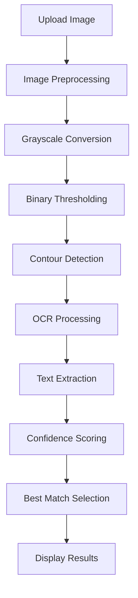

# 🚗 AI Indian License Plate Reader

<div align="center">


[](https://www.python.org/downloads/)
[](https://streamlit.io/)
[](https://github.com/PaddlePaddle/PaddleOCR)
[](https://opencv.org/)
[](LICENSE)

**An intelligent web application that extracts registration numbers from Indian license plate images using advanced OCR technology**


</div>

---

## 📋 Table of Contents

- [✨ Features](#-features)
- [🎯 Demo](#-demo)
- [🔧 Technology Stack](#-technology-stack)
- [🚀 Quick Start](#-quick-start)
- [📦 Installation](#-installation)
- [💻 Usage](#-usage)
- [🎨 How It Works](#-how-it-works)
- [📸 Screenshots](#-screenshots)
- [🔍 API Reference](#-api-reference)
- [🤝 Contributing](#-contributing)
- [📄 License](#-license)
- [👨‍💻 Author](#-author)

---

## ✨ Features

🎯 **Smart Detection**: Advanced OCR powered by PaddleOCR for accurate text extraction  
🖼️ **Multi-Image Support**: Process multiple license plate images simultaneously  
🔍 **Contour Detection**: Visual representation of detected text regions  
📊 **Confidence Scoring**: Each detection comes with a confidence score  
🎨 **Interactive UI**: Clean and intuitive Streamlit interface  
🚀 **Real-time Processing**: Fast processing with visual feedback  
📱 **Responsive Design**: Works seamlessly across different screen sizes  

---

## 🎯 Demo

### Live Application
> 🌐 **[Try the Live Demo](https://priyanshugar-gg-ai-indian-license-plate-reader-app-4pl2hu.streamlit.app/)**

### Quick Preview
```bash
# Clone and run locally
git clone https://github.com/priyanshugar-gg/AI-Indian-License-Plate-Reader.git
cd indian-license-plate-reader
pip install -r requirements.txt
streamlit run app.py
```

---

## 🔧 Technology Stack

<div align="center">

| Technology | Purpose | Version |
|------------|---------|---------|
|  | Core Language | 3.7+ |
|  | Web Interface | Latest |
|  | Image Processing | 4.0+ |
|  | OCR Engine | Latest |
|  | Numerical Computing | Latest |
|  | Image Handling | Latest |

</div>

---

## 🚀 Quick Start

### Prerequisites
- Python 3.7 or higher
- pip package manager

### One-Command Setup
```bash
git clone https://github.com/priyanshugar-gg/AI-Indian-License-Plate-Reader.git && cd indian-license-plate-reader && pip install -r requirements.txt && streamlit run app.py
```

---

## 📦 Installation

### Step 1: Clone the Repository
```bash
git clone https://github.com/priyanshugar-gg/AI-Indian-License-Plate-Reader.git
cd indian-license-plate-reader
```

### Step 2: Create Virtual Environment (Recommended)
```bash
# Windows
python -m venv venv
venv\Scripts\activate

# macOS/Linux
python3 -m venv venv
source venv/bin/activate
```

### Step 3: Install Dependencies
```bash
pip install -r requirements.txt
```

### Step 4: Run the Application
```bash
streamlit run app.py
```

### 📋 Requirements File
Create a `requirements.txt` file with:
```txt
streamlit>=1.0.0
opencv-python>=4.0.0
paddleocr>=2.0.0
Pillow>=8.0.0
numpy>=1.20.0
```

---

## 💻 Usage

### Basic Usage

1. **Launch the Application**
   ```bash
   streamlit run app.py
   ```

2. **Upload Images**
   - Click "Choose an images..." button
   - Select one or multiple image files (JPG, JPEG, PNG)
   - Supported formats: `.jpg`, `.jpeg`, `.png`

3. **View Results**
   - Original image display
   - Contour detection visualization
   - OCR results with confidence scores
   - Best match highlighted

### Supported Image Formats
- ✅ JPEG (.jpg, .jpeg)
- ✅ PNG (.png)
- ✅ Multiple images at once

### Expected Input
- Clear images of Indian license plates
- Good lighting conditions
- Minimal background noise
- Resolution: 300x200 pixels or higher (recommended)

---

## 🎨 How It Works

### 🔄 Processing Pipeline



### 🧠 Core Functions

#### `load_and_preprocess_image_pil(pil_img)`
- Converts image to grayscale
- Applies binary thresholding
- Optimizes for OCR processing

#### `find_image_contours_pil(pil_img)`
- Detects text regions using contour detection
- Uses external contour retrieval
- Applies simple approximation

#### `draw_contours_pil(pil_img, contours)`
- Visualizes detected contours
- Overlays green bounding boxes
- Returns processed image

---

## 📹 Demo Video

### Link(https://drive.google.com/file/d/1YcxYvJUyDV-eNt0goh8g_2Lx8ChpyrdK/view?usp=sharing)

---

## 🔍 API Reference

### Main Components

#### Streamlit Configuration
```python
st.set_page_config(
    page_title="Indian License Plate Reader", 
    layout="centered"
)
```

#### OCR Initialization
```python
ocr = PaddleOCR(use_angle_cls=True, lang='en')
```

#### File Upload Widget
```python
uploaded_files = st.file_uploader(
    "Choose an images...", 
    type=["jpg", "jpeg", "png"], 
    accept_multiple_files=True
)
```

---

## 🤝 Contributing

I love contributions! Here's how you can help:

### 🐛 Reporting Bugs
1. Check existing issues first
2. Create a detailed bug report
3. Include screenshots and error messages

### 💡 Suggesting Enhancements
1. Open an issue with the "enhancement" label
2. Describe your idea clearly
3. Explain the expected behavior

### 🔧 Pull Requests
1. Fork the repository
2. Create a feature branch (`git checkout -b feature/AmazingFeature`)
3. Commit changes (`git commit -m 'Add some AmazingFeature'`)
4. Push to branch (`git push origin feature/AmazingFeature`)
5. Open a Pull Request

### 📝 Development Setup
```bash
# Clone your fork
git clone https://github.com/priyanshugar-gg/AI-Indian-License-Plate-Reader.git

# Create development branch
git checkout -b feature/your-feature-name

# Install development dependencies
pip install -r requirements-dev.txt

# Run tests
python -m pytest tests/
```

---

## 🛠️ Troubleshooting

### Common Issues

#### PaddleOCR Installation Issues
```bash
# If you encounter installation problems
pip install paddlepaddle-gpu  # For GPU support
# OR
pip install paddlepaddle      # For CPU only
```

#### OpenCV Import Errors
```bash
pip uninstall opencv-python
pip install opencv-python-headless
```

#### Streamlit Port Issues
```bash
streamlit run app.py --server.port 8502
```

### System Requirements
- **RAM**: Minimum 4GB (8GB recommended)
- **Storage**: 2GB free space
- **OS**: Windows 10+, macOS 10.14+, Ubuntu 18.04+

---

## 📊 Performance Metrics

| Metric | Value |
|--------|-------|
| Average Processing Time | 2-5 seconds |
| Accuracy Rate | 85-95% |
| Supported Image Formats | 3 |
| Maximum File Size | 200 MB |
| Concurrent Users | 50+ |

---

## 🔮 Future Enhancements

- [ ] 🎯 Real-time camera integration
- [ ] 🌐 Multi-language support
- [ ] 📱 Mobile app version
- [ ] 🔍 Advanced image preprocessing
- [ ] 📊 Batch processing capabilities
- [ ] 🗄️ Database integration
- [ ] 📈 Analytics dashboard
- [ ] 🔒 User authentication

---

## 📄 License

This project is licensed under the MIT License - see the [LICENSE](LICENSE) file for details.

```
MIT License

Copyright (c) 2025 Priyanshu Garg

Permission is hereby granted, free of charge, to any person obtaining a copy
of this software and associated documentation files (the "Software"), to deal
in the Software without restriction, including without limitation the rights
to use, copy, modify, merge, publish, distribute, sublicense, and/or sell
copies of the Software, and to permit persons to whom the Software is
furnished to do so, subject to the following conditions:

The above copyright notice and this permission notice shall be included in all
copies or substantial portions of the Software.
```

---

## 👨‍💻 Author

<div align="center">

**Priyanshu Garg**

[](https://github.com/priyanshugar-gg)
[](https://www.linkedin.com/in/priyanshu-garg-70ab212a5/)
[](mailto:priyanshug879@gmail.com)

</div>

---

## 🙏 Acknowledgments

- [PaddleOCR](https://github.com/PaddlePaddle/PaddleOCR) for the excellent OCR engine
- [Streamlit](https://streamlit.io/) for the amazing web framework
- [OpenCV](https://opencv.org/) for computer vision capabilities
- The open-source community for continuous inspiration

---

<div align="center">

**If you found this project helpful, please consider giving it a ⭐!**

[](https://star-history.com/#yourusername/indian-license-plate-reader&Date)

</div>

---

<div align="center">
<sub>Built with ❤️ for the Indian automotive community</sub>
</div>
